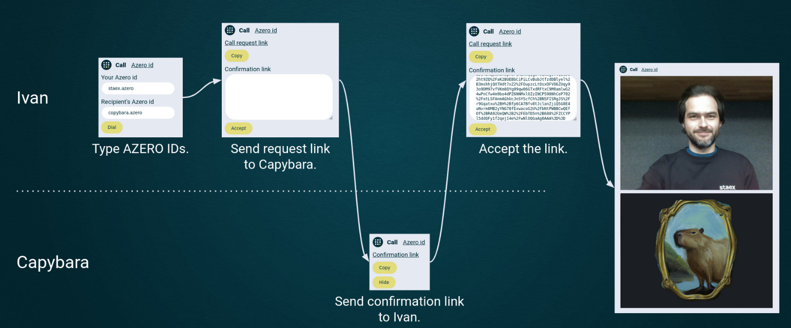

# Copybara — peer-to-peer and fully decentralized calls

The project goal is to integrate AZERO.ID name resolution into Staex public network on the example of peer-to-peer calls via WebRTC. This would allow anyone to make direct calls to their peers specifying only AZERO.ID. This id then translates to Staex id (which is a public key of the node) and this id in turn is used to contact the node over Staex public network.

AZERO.ID integration is not limited to peer-to-peer calls, but also allows sites registered with AZERO.ID be accessible from within Staex.

The project is deployed at https://copybara.staex.io/.


# Architecture



To use Copybara you need
- AZERO.ID domain,
- MCC-HTTP server running locally (included in the repo),
- MCC public node running locally (`mcc-public` package from [Staex repo](https://packages.staex.io/)).


## Address translation

Copybara translates AZERO.ID into Staex id. Staex id is a public of the node in Staex network. These ids are used in place of IP addresses to route the traffic.
Then MCC translates Staex id into dynamic IPv4 address which is used to actually route the traffic over underlying network.
The same Staex id may resolve to different IPv4 addresses on different nodes, and these addresses are temporary and local to the node.


## Initial handshake

Copybara uses WebRTC to stream video and audio from one node to another.
We don't have a signalling server (which makes this project truly decentralized), and the initial handshake is done by exchanging the links over some channel (e.g. messenger).
This channel doesn't need to be secure or private:
- the handshake contains public keys of the nodes that we got from AZERO.ID, and if they don't match the connection will fail;
- the real IP addresses are not leaked because we use dynamic node-local IP addresses.

Since we run on top of P2P Staex network we don't need STUN or TURN servers to communication which again improves privacy.

Staex end-to-end encrypts all the traffic in addition to standard WebRTC encryption.


# Project setup

You need Staex public network (`mcc` binary) to run the project.
You can install it from [here](https://packages.staex.io/), just replace `mcc` with `mcc-public` to get the right binary.
Alternatively run it as a [Docker container](https://packages.staex.io/docker/), again replace `mcc` with `mcc-public` to get the right binary.

```sh
# run web app
npm install
npm run dev

# run mcc-http server
cd mcc-http
npm install
npm run dev
```

In order to make calls you need to add `staex-id` field to your AZERO.ID with the value of Staex id of a particular node (as returned by `mcc id` command).


# Other

If you need to see all transactions by account (public key): `https://alephzero.subscan.io/account/5GTfcztcRBjBc1Tif4TP72K5X9p3zxAxYKV1kyNfxgTD4SU9?tab=transfer`.
